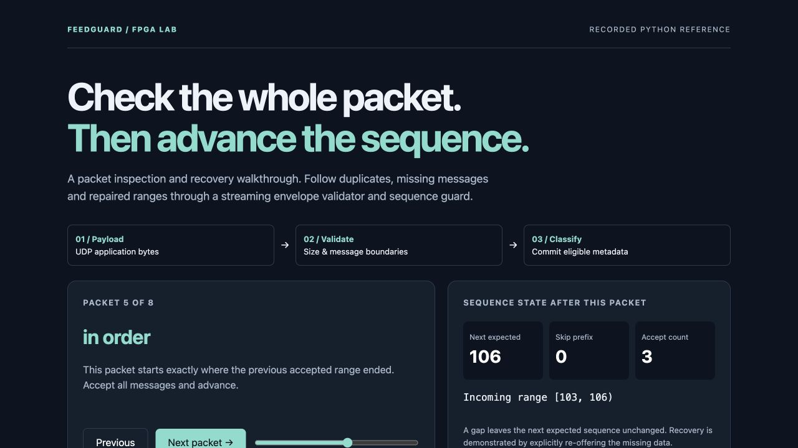
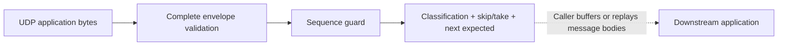

# FeedGuard FPGA

### Validate the packet before advancing the sequence

FeedGuard checks a UDP application payload's size and nested message boundaries, then
classifies its sequence range. Duplicates, overlaps, missing messages and malformed
packets have explicit outcomes. The Python reference and SystemVerilog implementation
are tested independently and together.



**Show it:** download or clone this repository and open **[docs/demo.html](docs/demo.html)**
in a browser. Step through eight recorded Python-reference packets and watch sequence
state, accepted counts and duplicate prefixes change. GitHub shows HTML as source;
download the file to run it. The page is self-contained and uses no external services.

## Run it yourself

```sh
python3 feedguard.py --output out/feedguard.json
python3 replay.py --trace out/feedguard.json --output out/feedguard-replay.html
```

Read the [two-minute demo guide](docs/SHOWCASE.md) for the gap-and-repair story.

## How it works



Input begins at the UDP application payload. There is no Ethernet MAC/PCS or optical
receive path. Message bodies are opaque; accepted metadata does not forward the bodies.
A production integration needs buffering/replay, message decoding and recovery.

| Classification | Sequence effect |
| --- | --- |
| Bootstrap | First valid data range establishes the next expected sequence |
| In order | Accept all messages and advance |
| Overlap | Skip the duplicate prefix; accept the new suffix |
| Duplicate | Accept nothing; hold state |
| Gap | Hold state until missing data is re-offered |
| Heartbeat | Never initialize or advance state |
| Malformed | Reject the packet; hold state |
| Reset required | Refuse a range crossing/exceeding the 32-bit session boundary |

This lab uses OMD-C-style envelopes and a 1,500-byte capacity, not an assertion about
current exchange certification or maximum message sizes. There is no live exchange
access, retransmission client, order book or trading logic. No 10 Gb/s or 40 ns result is claimed.
The project is independently implemented and credits its inspiration in [PROVENANCE.md](PROVENANCE.md).

## Current local evidence

| Check | Result |
| --- | --- |
| Python suite | 11 test methods passed |
| Envelope RTL | 410 deterministic vectors, gaps and output stalls |
| Sequence RTL | 1,013 vectors, session resets and stalls |
| Connected `feedguard_top` | 438 packet streams with concurrent producer/consumer, input/output stalls, reset during partial input and reset with pending output |
| Generic synthesis | `omdc_envelope`, `sequence_guard`, `feedguard_top` passed |

Read the [interface contract](docs/PROTOCOL.md), including reset, packet termination and
ready/valid rules. Bootstrap is not a recovered market snapshot.

## Verification you can reproduce

```sh
python3 -m unittest -v       # Python only
python3 sim/check_rtl.py     # Actual Icarus Verilog simulation
python3 verify.py            # Python + integrated RTL + demos + generic synthesis
```

Python 3.10+ and Git are required. The reference demo has no third-party Python dependencies.
Install Icarus Verilog (`iverilog` and `vvp`) for RTL. On macOS:

```sh
brew install icarus-verilog
python3 -m venv .venv
. .venv/bin/activate
python3 -m pip install yowasp-yosys==0.69.0.0.post1233
python3 verify.py
```

The verifier accepts native `yosys`, [YoWASP Yosys](https://yowasp.org/), or an explicit
`YOSYS=/path/to/executable`. It saves logs, tool versions and source SHA-256 hashes under
`out/verification/`. Missing tools or failed commands produce a failing exit status and
manifest. [Generic synthesis](https://yosyshq.readthedocs.io/projects/yosys/en/v0.65/using_yosys/synthesis/synth.html)
checks the logic structure; it does not establish device utilization, clock frequency,
routed timing or electrical operation.

The [retained local verification](evidence/local-verification/results.json) records the
showcase checks. Earlier files in `evidence/` describe the original publication baseline.
The [GitHub workflow](.github/workflows/verify.yml) runs the same verifier, but hosted
Actions were blocked before execution by account billing/spending limits during the
local audit. That is separate from the passing local results.

## What remains outside this release

No physical FPGA board, placed-and-routed design, timing closure, or measured hardware
latency is certified. These are demonstrable software and RTL projects. See the
[verification contract](docs/VERIFICATION.md) for coverage and remaining boundaries.

## License and attribution

MIT. See [LICENSE](LICENSE) and [PROVENANCE.md](PROVENANCE.md).
